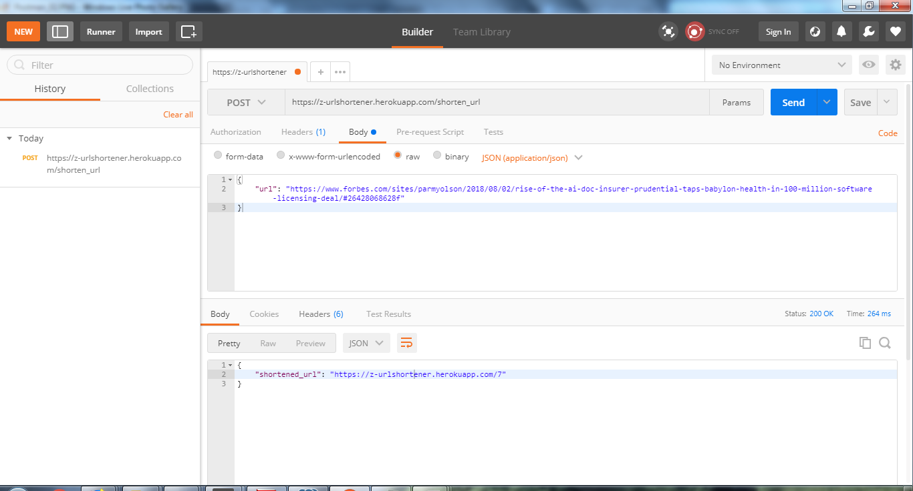

# URL Shortener
*- A Web Service using Python*

## Summary

This web service has a POST /shorten_url endpoint that receives a JSON body with the URL to shorten. A successful request returns a JSON body with the shortened url.

 

A GET request made to the shortened URL redirects the user to the the original URL, or the contents of the original URL is returned (hint: Postman).
