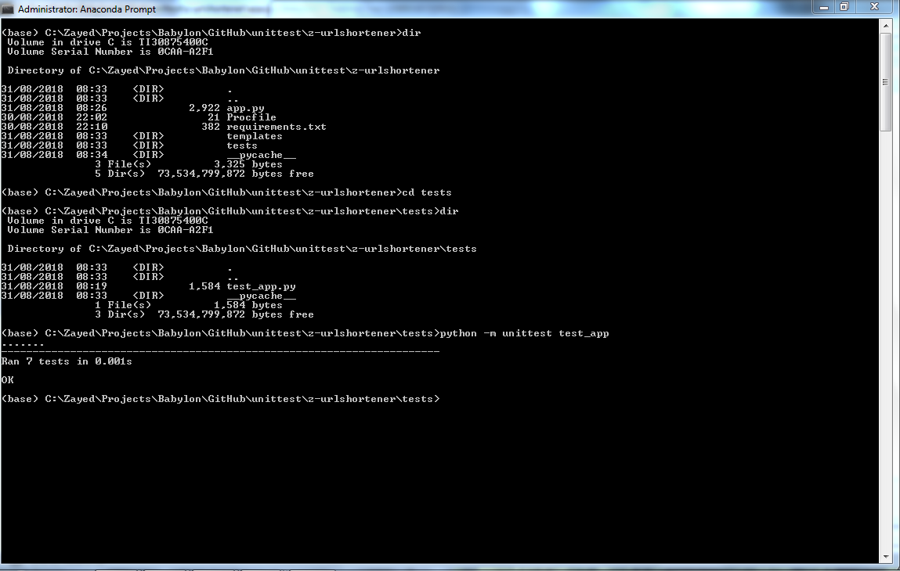

# URL Shortener
*- A Web Service using Python*

https://z-urlshortener.herokuapp.com

## Summary

This web service has a POST /shorten_url endpoint that receives a JSON body with the URL to shorten. A successful request returns a JSON body with the shortened url.

 

A GET request made to the shortened URL returns the contents of the original URL. The shortened URL redirects the user to the the original URL.

 

Appropriate validation on the URL to be shortened is performed.

 

                                                            
## Web Interface

The application is hosted on Heroku platform, and it has a web user interface.

 

A user can paste the URL to be shortened.

 

    

The URL is shortened. The shortened URL redirects the user to the original URL.

 

## Unittest

The application uses Base36 encoding to shorten URLs. The original URL has a hash mapping to the index of the URL in the database, which is converted to Base36 encoding, and returned as the shortened URL. Unit testing has been performed to scale upto a trillion requests.

 

The application was initially prototyped using SQLite database, but it has been deployed on Heroku using PostgreSQL database. PostgreSQL can handle production deployment at scale.
